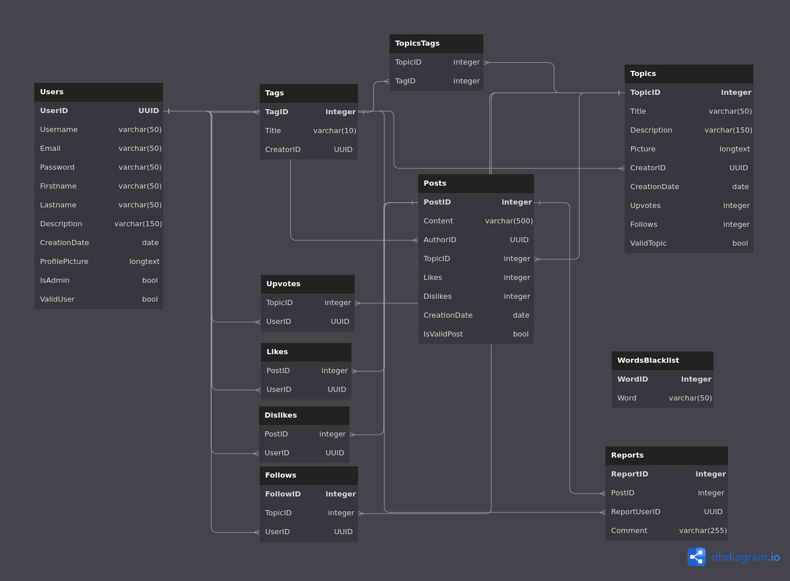

## LAUNCHING THE SERVER
In a terminal: "go run main.go".

Log in with :
    admin account
        login: admin
        password: admin
    user account
        create an account at: http://localhost:8080/register
# BEYOU FORUM
This readme corresponds to our latest B1 IT project: FORUM

## OVERALL PROJECT OBJECTIVES
The aim of this project is to create a forum in GOLANG. To do this, we need to set up a web server and create and operate an SQLite database. This project will also enable us to develop our web skills.
## LANGUAGES / TOOLS USED
The back-end language is golang (DB management, web server), the front-end language is html + css + js. We used figma (figma link: https://www.figma.com/file/spOOs4CXnSn8tGD0RWWn3S/Bword-Studio?type=design) to create our packaging.
## PROJECT ORGANIZATION
To organize our project, we took inspiration from the agile method. We divided our project into a list of tasks and worked in rush mode. To optimize this organization, we used trello (trello link: https://trello.com/b/fraINIRc/forum-beyou-studio). To share files within the group, we chose to use github.
## DB organization
We've tried to optimize our DB to manage as much as possible using sql.

# PROJECT REALIZATION
### Home page (http://localhost:8080/)
This is the home page of our site. It informs the user about how our forum works, and about the use of cookies. This page also shows the 3 most upvoted topics.
### Register page (http://localhost:8080/register)
This page allows the user to create an account in order to access all forum features. If the username or email address is already in use, an error pop-up appears. If you check rember me, you'll stay logged in forever, otherwise you'll be logged in for 6 hours.
### Login page (http://localhost:8080/login)
This page allows the user to log in and access all forum functions. If you enter your username or password incorrectly, a pop-up message appears. If you check rember me, you'll stay logged in forever, otherwise you'll be logged in for 6 hours.
### Account page (http://localhost:8080/account)
On this page, users can change all their information (profile photo, last name, first name, user number, bio, password). To change the profile picture, click on the picture. Users can permanently delete their account or log out.
### Page Profile (http://localhost:8080/profile)
Here users can view their topics and posts
### Explore page (http://localhost:8080/explore)
This page is the exploration page of our site. The user finds all topics here, and has the option of sorting them, or searching for a specific topic by name, or by the tags the topic contains. This is also where you can create a topic (if you're logged in).
## Page Topic (http://localhost:8080/topic/ + "topic name")
This page is accessed by clicking on "check topic".
On this page, users can read the various posts linked to a topic and/or add a new topic. They can also upvote or follow the topic. Clicking on a user's profile photo takes the user to their profile.
## Admin page (http://localhost:8080/automod)
This page is accessed when you are logged in as admin and click on report in the navBar.
On the pages, it's possible to report a post or topic thanks to the little flag.
All reports appear on this page, and the admin can ban the user (hammer icon), delete the post (trash can icon), and delete the report (cross icon).
The admin can also add or remove banned words.
When a user is banned, all their content is deleted from the database and the user appears in the "banned user" list, allowing the admin to unban them.
